# Machine Learning Assisted System Performance and Capacity Planning (MLASP) on Red Hat OpenShift

This is a demo for the overall process described in the MLASP research paper published at Springer EMSE on the Red Hat Openshift platform:

* [DOI](https://link.springer.com/article/10.1007/s10664-021-09994-0)
* Link to the [article](https://rdcu.be/cobcU)

In order to execute the below guide, access to a Red Hat OpenShift environment is required. If you don't have one, you can start a trial by creating an account at [RedHat Cloud website](https://cloud.redhat.com). Alternatively, it is also possible to execute the guide on a local (reduced version) of the platform, typically used for development purposes. Once you registered on the [RedHat Cloud website](https://cloud.redhat.com), you can obtain your version of the local Red Hat Openshift by downloading the installer from the [Console](https://console.redhat.com/openshift/create/local).

## Foreword

This repository presents a step by step guide on a possible setup of the MLASP process described in the before mentioned research article published by Springer's Empirical Sofware Engineering Journal.

The aim of this guide is to show a general approach to implementing the MLASP process described in the research paper on the RedHat OpenShift platform. Given the general form of the process, there may be different ways, meaning using different tools, to implement the different areas of the process.

The guide in this repository does not recreate the open-source system used in the initial research which is published in the [@SPEAR-SE](https://github.com/SPEAR-SE/mlasp) organization on GitHub.

For convenience, the overall MLASP process diagram is presented below:


## Introduction and Overview

As seen in the above diagram, there are three major areas of the MLASP process:

* Automated Load Testing: for training data generation.
* Machine Learning Modelling and Training : for creating a model that may be used for predictions.
* ML Model Serving (Inferencing): for using the previously trained model to provide predictions for two scenarios:
  * What if scenario: where the model will provide a prediction based on specific inputs.
  * Find a configuration with a given (percentage) deviation from a desired target.

We shall address these areas in the next sections.
This guide assumes a full version of RedHat OpenShift is used. The steps for deploying on the developer version (local) are the same, however the local version will not provide insights on the system metrics (i.e. pod CPU usage, pod memory usage, etc.). For demonstration purposes, only application metrics shall be used for the ML modelling process, therefore the fact that an OpenShift Local instance does not provide these details are irrelevant for the demonstration.

## What is Red Hat OpenShift

[Red Hat OpenShift Container Platform](https://www.redhat.com/en/technologies/cloud-computing/openshift/container-platform) is a leading enterprise Kubernetes platform that enables a cloud-like experience everywhere it's deployed. Whether it’s in the cloud, on-premise or at the edge, Red Hat OpenShift gives you the ability to choose where you build, deploy, and run applications through a consistent experience (Source: [RedHat](https://www.redhat.com/en/technologies/cloud-computing/openshift)).

In other words, Red Hat OpenShift Container Platform is a private Platform as a Service (PaaS) for enterprises that run OpenShift on public clouds or on-premises infrastructure. The OpenShift platform is a consistent hybrid cloud foundation for building and scaling containerized applications. In other words, it is an open-source container orchestration platform for enterprises. It includes several container technologies, primarily the OpenShift container orchestration software, which is based on the OKD open-source project. Red Hat OpenShift combines Kubernetes components with security features and productivity necessary for large enterprises and is especially useful in hybrid cloud scenarios.

Red Hat OpenShift uses operators. [Operators](https://docs.openshift.com/container-platform/4.11/operators/understanding/olm-what-operators-are.html) are pieces of software that ease the operational complexity of running another piece of software.

Throughout this guide we shall use several operators for different purposes.

## Automated Load Testing

One way to achieve automation inside RedHat Openshift is with the help of [Tekton](https://tekton.dev/) pipelines. Tekton is available as an operator inside OpenShift and may be installed globally on the cluster from within the Operator Hub where they are called ***RedHat OpenShift Pipelines***


To install the operator, click on it's name and then click on the install button:


Leave the defaults on and click install:


Please wait for the operator to complete installation before continuing.

Tekton is a Kubernetes native implementation of CI/CD systems which in our case we shall use to automate the load testing of a subject system for activities such as:

* Generate load test parameters for the controlled load generator application.
* Generate configuration parameters for the subject test system (including number of instances).
* Deploy the subject test system using the generated parameter configuration for the load test.
* Extract (in a non-intrusive way) and store load test results into a timeseries database (used later on as input for the ML modelling).
* Perform cleanup after a load test.

A Tekton pipeline is formed from Tasks that may execute in parallel or in sequence, depending on the workflow definition of the pipeline. Remember, Tekton is a kubernetes native system which means every task lives inside it's own Kubernetes pod.

In this demonstration we use [bombardier](https://github.com/codesenberg/bombardier) as load generator. We can control several of its parameters to apply different load configurations over the test subject system, which is in our case a mock simulator, [Wiremock](https://wiremock.org/). We selected Wiremock for the test subject as it is a generic web server that may provide templated responses following a specified distribution for the response time, such as uniform distribution, which is typical for production systems. Following the details of the MLASP paper, we shall try to model the throughput of the wiremock application by altering some of its web server parameters. We shall apply load over differen wiremock configuration and measure the throughput which we then will later model inside the RedHat OpenShift Platform.

The tekton pipeline executing a load test has several different tasks as mentioned above. Tasks which generate parameter ranges such as how many threads the wiremock shall use to process incoming requests, tasks which control deployment, tasks which extract information and store it in a (timeseries) database, and task for cleanup.

A tekton pipeline may be created outside of the RedHat Openshift platform and then imported using the ```oc``` command. Additionally, a tekton pipeline may be created directly inside the OpenShift's web console, either by directly writing the yaml file for the pipeline, or using the graphical interface for linking the tasks. The visual representation of the pipeline makes it easy to understand what steps are executed in parallel or in sequence and at what stage. The earlier mentioned steps have been groupped together in a pipeline having the following visual representation:


For this demonstration purposes, the pipeline is provided as part of this repository.
Although the Tekton (as an operator) is global for the entire OpenShift cluster, a pipeline and its tasks reside inside a namespace (a.k.a project). For the purposes of this demonstration we shall use the ```demo1``` project. The project may be created directly using the OpenShift web console, or using the command line interface (the ```oc``` tool).
For convenience, througout this demonstration, we shall use at times the web console and some other times the CLI interface. A quick way to connect the CLI to the cluster is by obtaining a direct access token from the OpenShift web console. Once authenticated in the console, click on the user name (right-up corner) and then on the *copy login command* option.

In the next screen you will see a *Display token* link. Click on it to obtain the security details. Use the login command in terminal screen to log into the cluster and create the project where the automation pipeline and its task will reside (in our case, demo1).

```bash
oc login --token=<token> --server=<https://api.clustername.com:6443>
oc new-project demo1
```

To import the pipeline and its tasks into OpenShift, ensure you are in the correct namespace (i.e., demo1) and apply first the tasks' yaml definitions followed by the pipeline's yaml definition:

```bash
oc project demo1
oc apply -f task-generate-random-number.yaml
oc apply -f task-bombardier-deploy.yaml
oc apply -f task-scale-deployment.yaml
oc apply -f task-lt-summary.yaml
oc apply -f task-wiremock-cleanup.yaml
oc apply -f task-wiremock-deploy.yaml
oc apply -f task-calculate-cthreads-value.yaml
oc apply -f auto-multipod-lt-wiremock.yaml
```

After executing all the above, you should see inside the console all the tasks and pipeline definitions listed.
Before running the pipeline, we must add an additional resource into the project space: a timeseries database where the load tests results are stored. This example uses [InfluxDb](https://www.influxdata.com/). Let's set it up and configure it to allow the lt-summary task write the load test summary in it.

First, we need some storage where InfluxDb shall store the collected data. To do that, we need to have a *Persistent Volume* (PV) and a *Peristent Volume Claim* (PVC) reserved for the timeseries database. This can be easily achieved using the OpenShift web console.

We shall create the PVC. If the OpenShift is running on a cloud provider (e.g., AWS infrastructure), the PV will be automatically created whenever the PVC is bound and used. Binding happens whenever the PVC is used by a Deployment. Let's create the PVC then using the OpenShift web console.

Using the left navigation, select Storage/PersistenVolumeClaim and click on the create button.

Ensure you are in the ```demo1``` project space and fill in the name of the storage as ```influxdb```. Select the approapriate storage class. In this case, as OpenShift is deployed on top of AWS, the gp2 storage class was automatically created for OpenShift during its provisioning. Also ensure that access mode is ReadWriteOnce (RWO) and volume mode is *Filesystem* and select an appropriate size for the file system (e.g., 5GB):


Wait for the PVC to be created before continuing to the next step, which is deploying InfluxDb using a *Deployment* resource.
Before we deploy Influx, we must setup the secrets for its database backend. The resources can be created in the web console or using the CLI, as described below:

```bash
oc project demo1
oc apply -f influxdb-creds.yaml
oc apply -f influxdb-deployment.yaml
```

Now we need to connect to the influxdb instance and check the database.

```bash
oc project demo1
oc rsh $(oc get pods | grep influx | awk '{print $1}')
```

The above commands will do a remote SSH into the InfluxDB pod. Once connected to the pod execute the below sequence of commands:

```bash
influx
create database bombardier
exit
exit
```

There are two ```exit``` commands required, the first to exit the InfluxDB application and the second to exit the pod.

Before we start the automated load tests we need to expose the InfluxDB endpoint as a service inside OpenShift so that it is visible to other applications inside the cluster. Note that we only expose it the endpoint inside the cluster (in other words we don't add also a route to the service). The service creation is done running the following command:

```bash
oc expose deployment influxdb --port=8086 --target-port=8086 --protocol=TCP --type=ClusterIP
```

Now we are ready to execute on the load test automation using the ```loop_lt_multipod_pipeline_wiremock.sh``` shell script (please note this script requires to have also the tkn command line tool installed on your system).
The script controls the number of iterations though the ```$RUNS``` environment variable, which must be set before using it. The script uses internally the tkn command line tool for Tekton pipelines control inside OpenShift and uses a number of parameters associated with the pipeline. If you want to change the defaults, alter directly the values in the script before running it. To execute the script with the defaults run the following commands on your system.

```bash
export RUNS=10
./loop_lt_multipod_pipeline_wiremock.sh
```

Please note the first time the pipleline is executed OpenShift will download any missing resources, such as bombardier's docker image hosted on dockerhub, the test subject image which encapsulates wiremock, as well as any other helper image required by the pipeline execution, therfore the first run will take a bit longer to complete. Please also remember this is a load test and the duration if the test is given as a parameter to bombardier (randomly picked from a pre-configured range which has been defined inside the loop starter script).

All the load test executions (as pipeline runs) are stored inside OpenShift and they can be inspected any time later.
To perform a quick cleanup of all the completed load tests (so that only the summary results stored inside InfluxDb are kept), run the following commands:

```bash
oc project demo1
oc delete pod --field-selector=status.phase==Succeeded
```

## Machine Learning Modelling

As load testing data gathers we can prepare for the next stage of the MLASP process, namely the ML modelling and training part.
A simple and straightforward way of achieving this step is making use of the [Open Data Hub](https://opendatahub.io) operator which is a blueprint architecture for machine learning workloads on Kubernetes based platforms. Open Data Hub is formed of several independent tools and projects. For the purposes of this demonstration we only need the JupyterHub component as an IDE used by ML practitioners and Data Scientists to prepare data for machine learning modelling and then build and train machine learning models.

To install the Open Data Hub (ODH) operator on OpenShift, we shall use the web console. As a cluster admin user, navigate to the Operators > Operators Hub page and type in Open Data Hub in the search box:
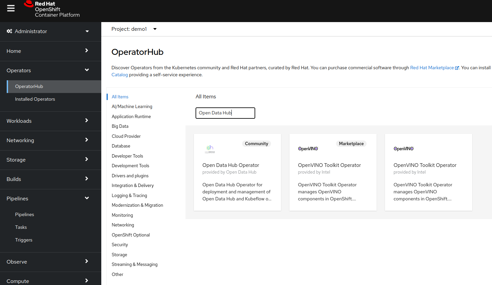

Click on the operator, aknowledge the message (about the community opereator) and then click install.
[!ocp-odh-02](images/ocp-odh-02.png)
Accept all the defaults and click on install. Wait for the installation to complete before going to the next step.
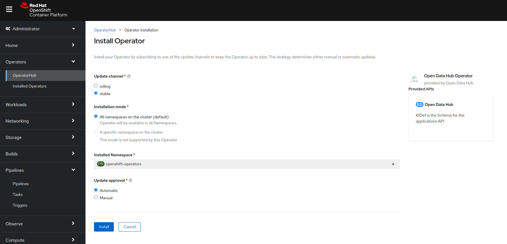

Once the installation has completed, we need to create an instance of the operator and select which components we want to use. For that we need a Kubernetes namespace (a.k.a OpenShift project). Let's call our instance ```opendatahub```.
Using the web console, in the administrator view, navigate to Home > Projects and click on the create project button:
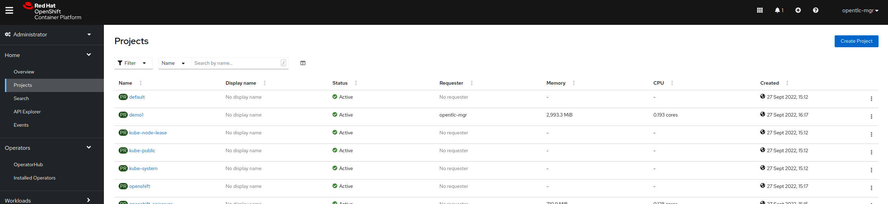
In the pop-up that is displayed on the screen fill in the name box ```opendatahub``` and click on the create button:
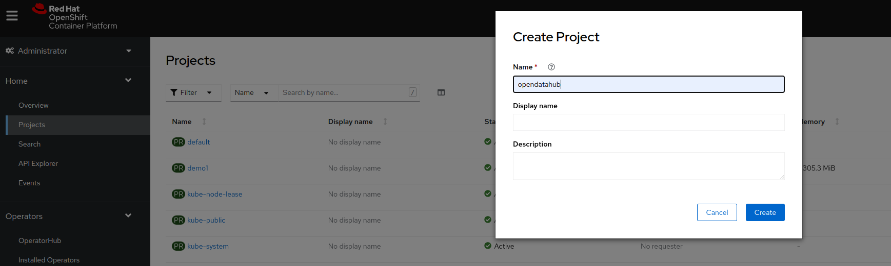
Now that we have the project namespace ready we can instantiate the operator by going to Operators > Installed Operators and selecting Open Data Hub
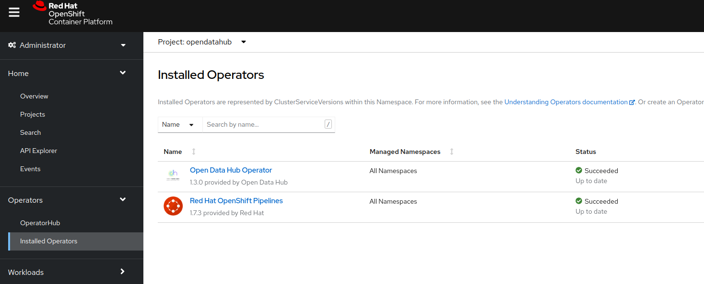
The next screen will present options on how to deploy ODH (using the default way or by deploying Kubeflow only). We shall use the default way in this case by clicking on the "Create instance" link of the tile displayed on top of the page (under Provided APIs section):
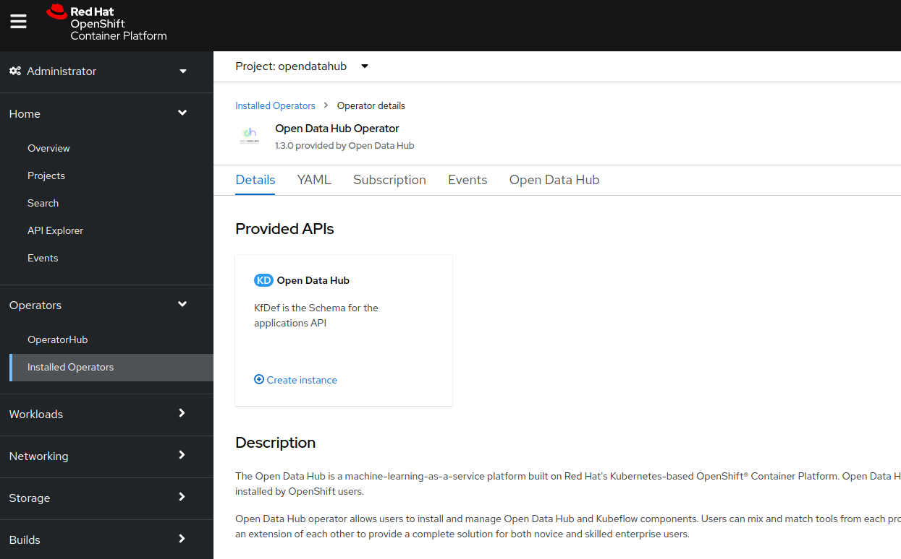
In the next screen, switch to the *YAML view* and keep only the following entries under the spec: odh-common, jupyter-hub, notebook-images, and odh-dashboard:

Click on create and wait a few minutes for components to install. During the installation process OpenShift will also create the necessary routes to access the applications. Check under Networking > Routes for them to show up.

Alternatively, the instance may be creating from the command line interface running the following commands:

```bash
oc project opendatahub
oc apply -f odh-instance.yaml
```

Using the navigation menu on the web console interface, click on the ODH Portal external URL from under Networking > Routes. A new tab/window should open asking you to authenticate followed by permissions check. Leave everything on and click on *Allow selected permissions* button:
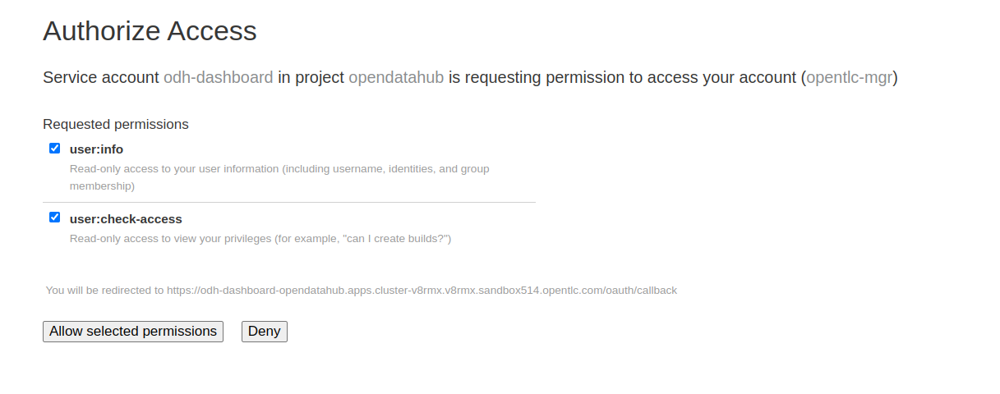
This will complete the ODH dashboard setup and let you access JupyterHub inside it.
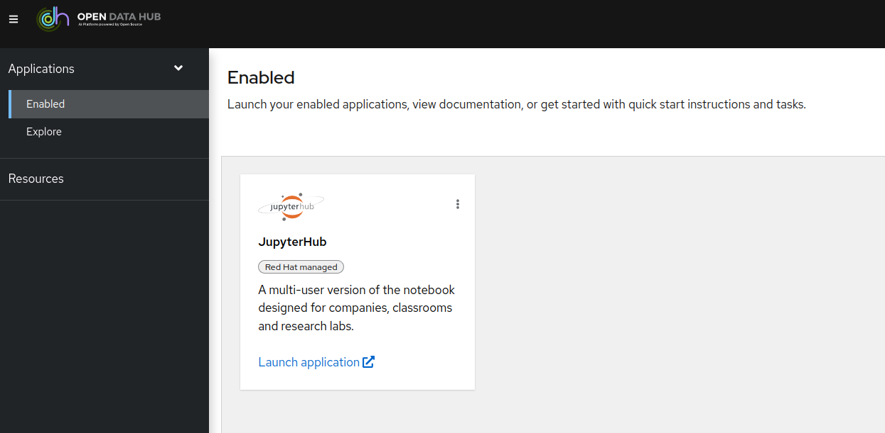
Click on the "Launch application" link under the JupyterHub tile. This will open yet another window/tab asking for permissions confirmation.
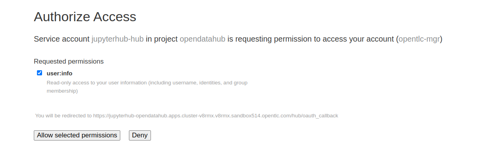
This step is required since as you recall from above, ODH is a set of independent projects and the dashboard is just another component which groups these components in a convenient way to be accessed. Once the permissions are set, you will see a page where different notebook images are available. These images are packaged for convenience with the ODH operator. Each image is pre-loaded with specific python libraries used for data science. Additional images may be added, and on the existing images additional libraries may be installed as well.
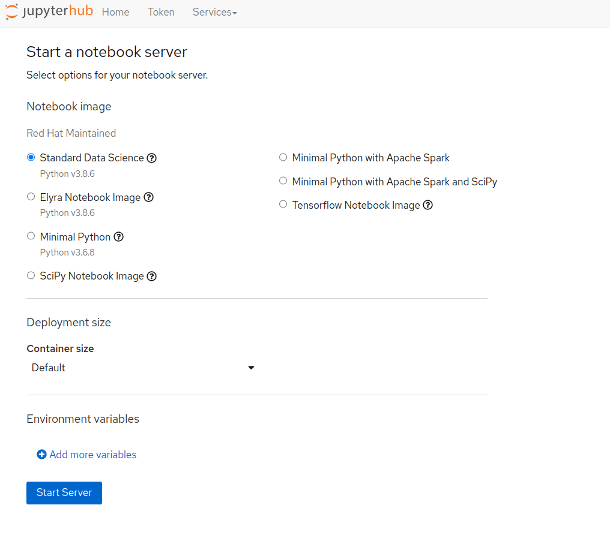
OpenShift also provided CUDA support for NVIDIA based graphic cards (if they are available to the cluster), this subject is however outside of the scope of our demo.
Another area outside of the scope of this demo is to reproduce the different ML architectures presented by the [MLASP](https://rdcu.be/cobcU) paper and published in the [SPEAR-SE MLASP](https://github.com/SPEAR-SE/mlasp) repository. We shall present however, as a generic approach, how to use the Jupyter inside OpenShift to process the load test data which has been summarized inside the InfluxDB timeseries database and create a simple model and train it. We shall then package the trained model into a new container for inferencing on the two use cases mentioned earlier in this article.

Let's get started. From the JupyterHub console we shall launch a notebook server. As we shall build an XGB based model, we can make use of the standard datascience notebook, with a medium sized container:
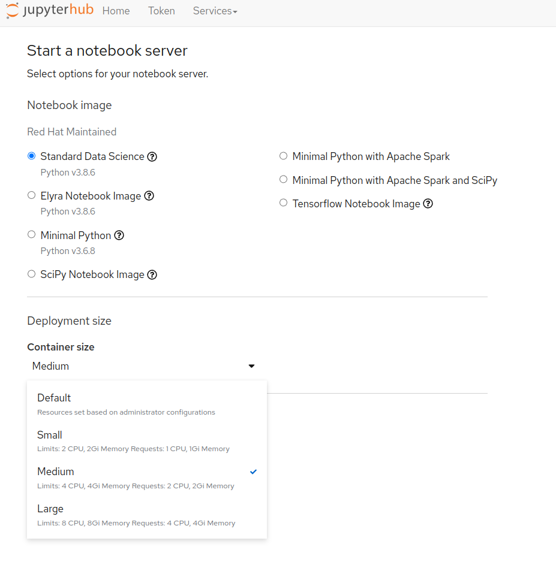

Once the server is started, you can either type in all the commands in the notebook cells following the prepared notebook in the  section of this repository (or just import them by using the upload function inside the JupyterLab IDE).

The first notebook is about the data preparation. Before data is analyzed, it must be retrieved from its source, in our case the InfluxDB. The Python programming language has a library for connecting and retrieving data out of InfluxDB backends and convert them to an object format compatible with the Pandas library (typically used for data manipulation in datascience projects).
The retrieved data and pre-processed data is then stored in a csv file to be used later on for training.

The second notebook is where the model is created and trained on a subset of the extracted data (typically a 80%-20% split for training and testing purposes). Once the model is trained, it may be used for inferencing.

## Model Serving

In order to use an ML model, it must be packaged and deployed as a service to be called by another application. As explained earlier we shall use our trained model to provide inference on two scenarios:

* What if scenario: where the model will provide a prediction based on specific inputs.
* Find a configuration with a given (percentage) deviation from a desired target.

The model serving may easily be implemented with the help of the [Seldon](https://seldon.io) framework (also available as an operator for OpenShift, or by being packaged in a container which is then deployed on OpenShift).

[TODO] Describe Seldon deployment.

Now that we have our model served, we need an application which can query the model for predictions and then provide a response based on the provided input. By keeping the model standalone it will be easy to provide updated versions (after retraining in case of model drift, or just because new data is available)...
